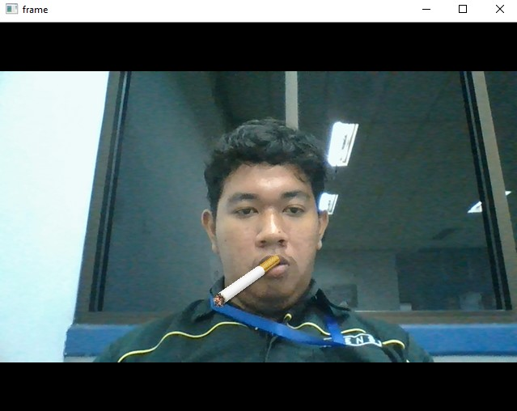

# Description
 Creating instagram filter with Opencv Python using Bayesian Segmentation Method and OTSU Thresholding

# Requirements
Python 3  
Opencv 3.4.2  
Numpy  
Bayesian-sgm

# Dataset
Dataset are captured from my own phone, and for the alpha dataset edited using Photoshop

# How it Works
Webcam Picture is segmented based on color skin by using bayesian that already train using the dataset. After that, the result from the Bayesian segmentation is thresholded with the OTSU thresholding method. The masking process is using to masking the result from the thresholding method and the original image.  After all, Contour all calculated from the masking result and add cigarette  on the centroid of the contour.

# Testing
